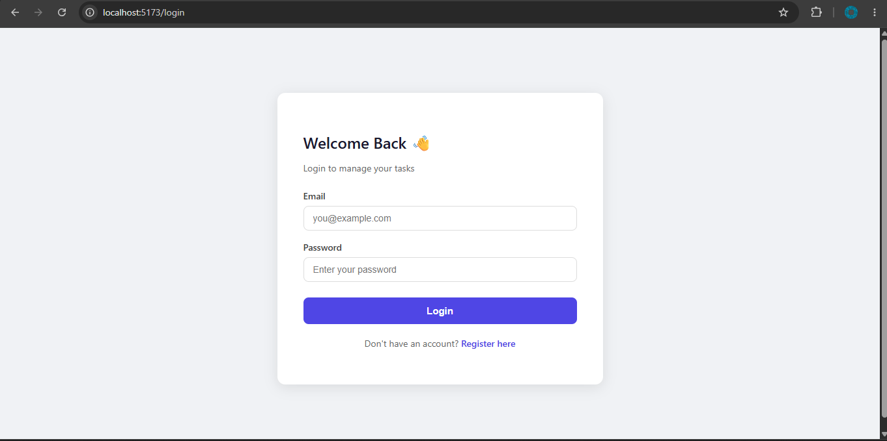
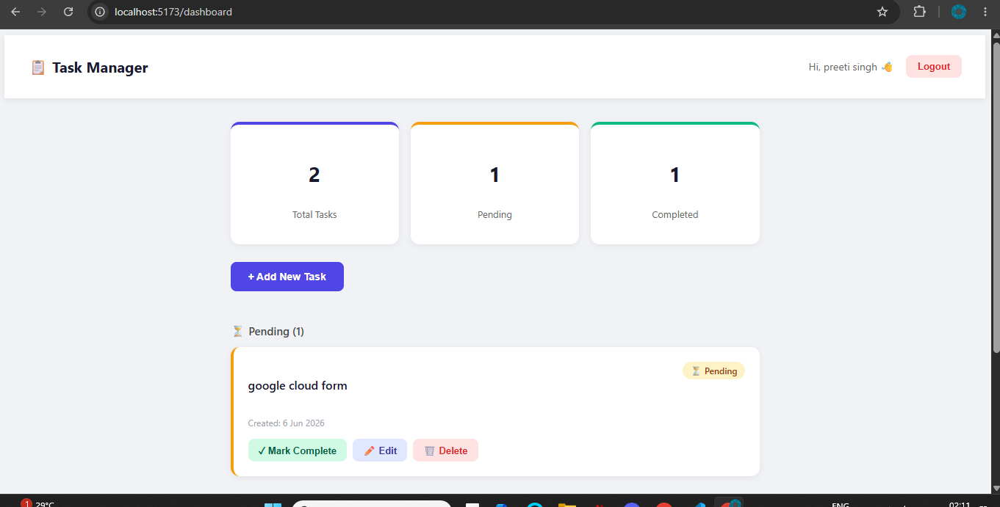

# Task Manager App — MERN Stack

A full-stack Task Management Web Application built with the MERN stack (MongoDB, Express.js, React.js, Node.js).

## Features

- User Registration and Login with JWT Authentication
- Create, Edit, Delete Tasks
- Mark tasks as Completed or Pending
- Protected Routes — only logged in users can access dashboard
- Responsive UI built with React
- Secure password hashing with bcryptjs

## Tech Stack

**Frontend:** React.js, React Router DOM, Axios  
**Backend:** Node.js, Express.js  
**Database:** MongoDB Atlas  
**Authentication:** JSON Web Tokens (JWT), bcryptjs  

## Setup Instructions

### Prerequisites
- Node.js v18 or higher
- MongoDB Atlas account (free tier)

### 1. Clone the repository
git clone https://github.com/preetiii-singh/task-manager.git
cd task-manager

### 2. Setup Backend
cd server
npm install
Create a `.env` file inside `server/` folder:
PORT=5000
MONGO_URI=your_mongodb_connection_string
JWT_SECRET=your_jwt_secret_key
Start the backend server:
npm run dev

### 3. Setup Frontend
cd ../client
npm install
npm run dev

### 4. Open the app in browser

## API Endpoints

| Method | Endpoint | Description | Auth |
|--------|----------|-------------|------|
| POST | /api/auth/register | Register new user | No |
| POST | /api/auth/login | Login user | No |
| GET | /api/tasks | Get all tasks | Yes |
| POST | /api/tasks | Create new task | Yes |
| PUT | /api/tasks/:id | Update task | Yes |
| PATCH | /api/tasks/:id/toggle | Toggle task status | Yes |
| DELETE | /api/tasks/:id | Delete task | Yes |

## Screenshots

### Login Page

### Dashboard

## Database Schema

### User
{
name: String,
email: String (unique),
password: String (hashed),
timestamps: true
}

### Task
{
title: String,
description: String,
status: "pending" | "completed",
userId: ObjectId (ref: User),
timestamps: true
}

## Author

**Preeti Singh**  
MERN Stack Assignment
